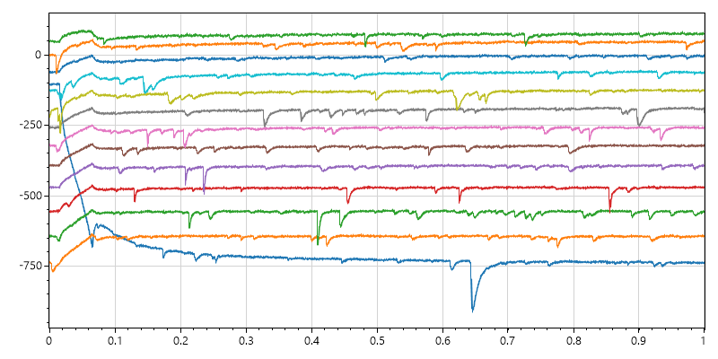

# ABFauto
ABFauto performs automated analysis of electrophysiology data in ABF files. It is probably only useful to the authors as it is highly specific to the experiments they perform.

ABFauto is written in C# and uses [ABFsharp](https://github.com/swharden/ABFsharp) to interface ABF files and display them using [ScottPlot](https://github.com/swharden/ScottPlot). 

A similar project for Python is [pyABFauto](https://github.com/swharden/pyABFauto) which interfaces ABF files using [pyABF](https://github.com/swharden/pyABF) and displays graphs using [matplotlib](https://matplotlib.org/)

